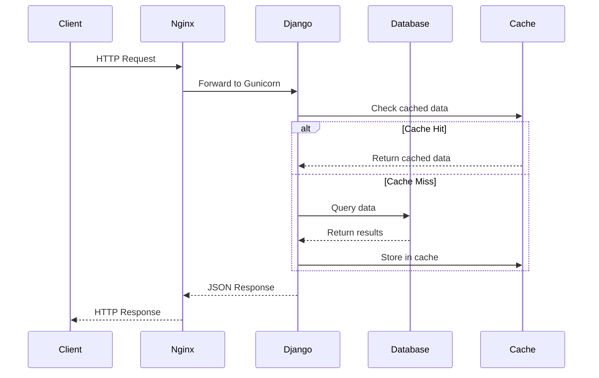

# NewsHub Backend Architecture

## Technology Stack
- **Framework:** Django 4.2 LTS
- **API:** Django REST Framework 3.14
- **Database:** SQLite (dev), PostgreSQL (prod)
- **Rich Text:** CKEditor
- **Authentication:** Token + Session
- **CORS:** django-cors-headers

## Project Structure
```
backend/
├── apps/
│   ├── core/          # Utilities, middleware, validators
│   ├── news/          # News content models and APIs
│   └── users/         # User authentication and authors
├── config/            # Django settings and URLs
├── docs/              # Documentation
├── media/             # User-uploaded files
├── scripts/           # Automation scripts
└── manage.py
```

## Design Patterns

### Service Layer Pattern
Business logic is separated into service classes (`services.py`) to keep views thin and promote reusability.

**Example:**
```python
# Instead of in views.py
ArticleService.get_trending(days=7, limit=10)
NewsletterService.subscribe(email)
```

### Repository Pattern (via Django ORM)
Models act as repositories with custom managers and querysets for complex queries.

### Middleware Pattern
Custom middleware for cross-cutting concerns like view counting.

## Data Flow



## Security Measures
- CSRF protection enabled
- Token-based authentication
- Password validation
- SQL injection prevention (ORM)
- XSS protection (template escaping)
- File upload validation
- CORS whitelist

## Performance Optimizations
- Database query optimization with `select_related()` and `prefetch_related()`
- Pagination for large datasets
- View count caching (1 hour per IP)
- Static file serving via Nginx
- Database indexing on frequently queried fields

## Scalability Considerations
- Stateless API design
- Horizontal scaling ready
- Database connection pooling
- CDN for media files
- Redis for caching and sessions
